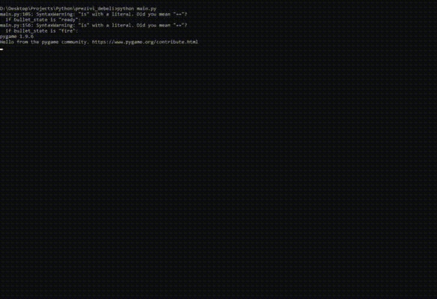

# Prezivi Debeli     

 A small and simple survival 2D game created with **pygame** Python module. 
 
 You're fighting against all junk food shooting them with broccoli and helping me stay alive. 
 

 

  

## Requirements
 - math
 - random
 - pygame
